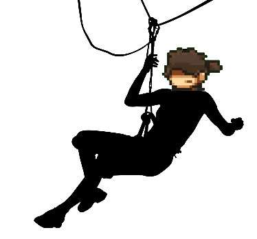
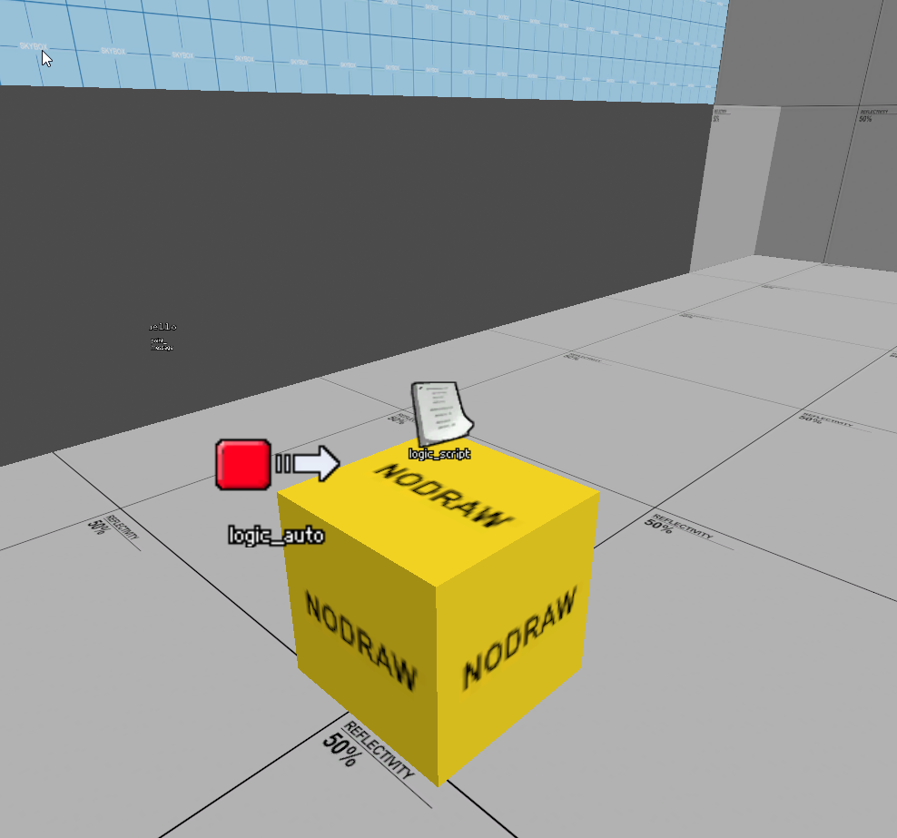
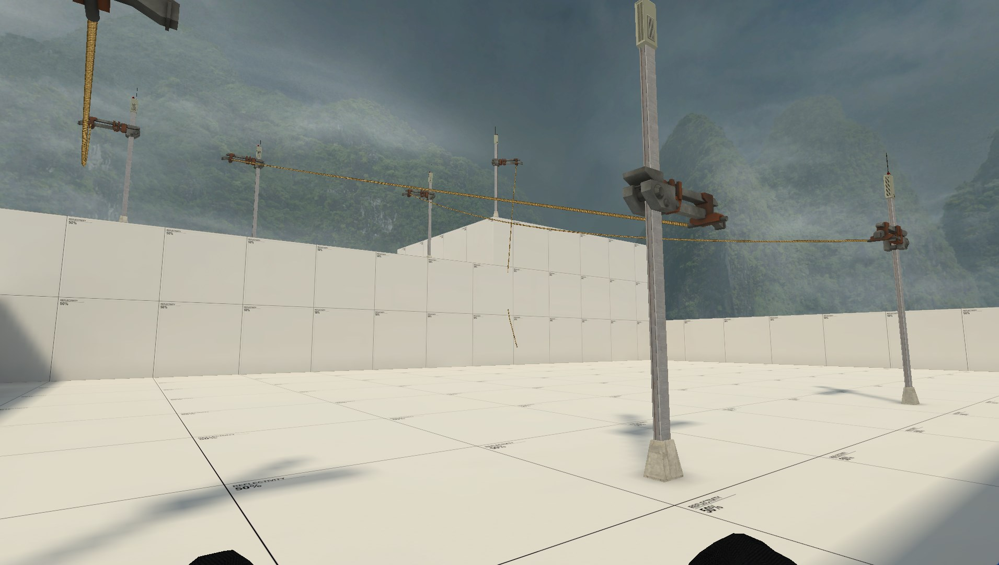
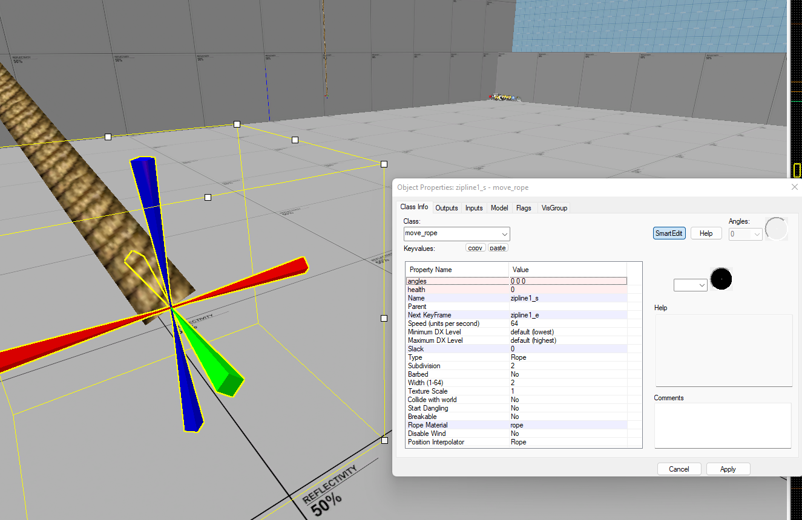

# Nmrih-Zipline-Addon 
No more room in hell zipline addon using vscript

Add the ZipLine templates and logic_script to your map to enable the addon.

Add this

To create a zipline:
Make two move_ropes with names ziplineX_s and ziplineX_e with X being any number. The addon will automatically detect these and generate a zipline between these move ropes.
Start is '_s', end is '_e', if the end has '_ee' it's one way.

 Example zipline setup 

Examine the zipline_example.vmf for an example ( or copy paste from it! ).

Special Thanks to Zool for the original code.
